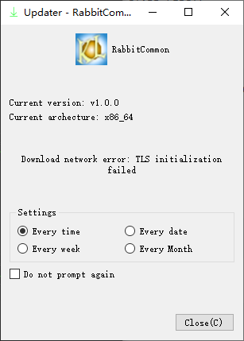

## Qt common library

================================================

Author：Kang Lin（kl222@126.com)

[](https://ci.appveyor.com/project/KangLin/rabbitcommon)
[](https://github.com/KangLin/RabbitCommon/actions/workflows/build.yml)
[](https://github.com/KangLin/RabbitCommon/actions/workflows/build.yml)

[:cn: Chinese](README_zh_CN.md)

- Project home site: https://github.com/KangLin/RabbitCommon
- Mirror:
  - https://sourceforge.net/projects/rabbitcommon/
  - https://launchpad.net/rabbitcommon
  - https://gitlab.com/kl222/RabbitCommon

### Developer documetns

[Online developer documetns](https://kanglin.github.io/RabbitCommon/English/html/index.html)

### Latest release

[Latest release](https://github.com/KangLin/RabbitCommon/releases/latest)

### Functions

[API](https://kanglin.github.io/RabbitCommon/English/html/group__API.html)

Qt common library. include follow functions:

- [x] GUI
  - [x] [About](#About)
    + [cmark](https://github.com/commonmark/cmark): support MarkDown
  - [x] [Updater](#Updater)
  - [x] [QUIWidget](Src/QUIWidget/QUIWidget.h)
  - [x] [Style (include icon theme)](Src/FrmStyle/FrmStyle.h)
  - [x] [Recent open menu](Src/RabbitRecentMenu.h)
  - [x] [Title bar](Src/TitleBar.h)
  - [x] [Folder browser](Src/FolderBrowser/FolderBrowser.h)
- [x] [Download the same file from multiple URLs](Src/DownloadFile.h)
- [x] [Directory functions](Src/RabbitCommonDir.h)
- [x] [Encrypt](Src/RabbitCommonEncrypt.h)
- [x] [Register](Src/RabbitCommonRegister.h)
- [x] Tools
  + [x] [Execute the program with administrator privileges](#execute-the-program-with-administrator-privileges)
  + [x] [The program starts automatically](#the-program-starts-automatically)
  + [x] [Directory functions](Src/RabbitCommonDir.h)
  + [x] [Get system information](#Get-system-information)
    - [x] [Get current login user name](#Get-current-login-user-name)
- [x] cmake functions
  + [x] Translations
  + [x] Add target, plugin target
  + [x] Add unistall target
- [x] Cross-platform, support multiple operating systems
  - [x] Windows
  - [x] Linux、Unix
  - [x] Android
  - [ ] Mac os
  - [ ] IOS
  
  Mac os and IOS, I don't have the corresponding equipment,
  please compile and test the students with the corresponding equipment.

### Compile
- Create and entry build directory

        git clone --recursive https://github.com/KangLin/RabbitCommon.git
        cd RabbitCommon
        mkdir build

- Compile
  + Use cmake

        cd build
        cmake ..  -DCMAKE_BUILD_TYPE=Release
            -DQT_DIR=... \
            -DQt5_DIR=${QT_ROOT}/lib/cmake/Qt5
        cmake --build .

    * Parameter
      - CMAKE_BUILD_TYPE: build type(MUST)
      - QT_DIR: Qt install position
      - BUILD_DOCS: build doxygen documetns
      - BUILD_APP: build app
      - BUILD_ABOUT: build about
      - BUILD_UPDATE: build updater
      - BUILD_ADMINAUTHORISER: build admin authoriser

    **NOTE**: If you use MSVC, you need to add -DCMAKE_BUILD_TYPE=Debug,
              otherwise the following error will occur when compiling Debug:

          RabbitCommonTools.obj : error LNK2019: An external symbol that cannot be resolved "int __cdecl qInitResources_translations_RabbitCommon(void)" (?qInitResources_translations_RabbitCommon@@YAHXZ)，该符号在函数 "void __cdecl g_RabbitCommon_InitResource(void)" (?g_RabbitCommon_InitResource@@YAXXZ) 中被引用
          RabbitCommonTools.obj : error LNK2019: An external symbol that cannot be resolved "int __cdecl qCleanupResources_translations_RabbitCommon(void)" (?qCleanupResources_translations_RabbitCommon@@YAHXZ)，该符号在函数 "void __cdecl g_RabbitCommon_CleanResource(void)" (?g_RabbitCommon_CleanResource@@YAXXZ) 中被引用

    - linux
  
          cd build
          cmake .. -DCMAKE_INSTALL_PREFIX=`pwd`/install \
               -DCMAKE_BUILD_TYPE=Release \
               -DQT_DIR=... \
               -DQt5_DIR=${QT_ROOT}/lib/cmake/Qt5
          cmake --build . --config Release --target install
      
    - windows
  
          cd build
          cmake .. -DCMAKE_INSTALL_PREFIX=`pwd`/install ^
                 -DCMAKE_BUILD_TYPE=Release ^
                 -DQT_DIR=... ^
                 -DQt5_DIR=${QT_ROOT}/lib/cmake/Qt5
          cmake --build . --config Release --target install
  
    - Android
      - The host is linux
      
            cd build
            cmake .. -DCMAKE_BUILD_TYPE=Release \
                   -DCMAKE_INSTALL_PREFIX=`pwd`/android-build \
                   -DCMAKE_TOOLCHAIN_FILE=${ANDROID_NDK}/build/cmake/android.toolchain.cmake \
                   -DANDROID_ABI="armeabi-v7a with NEON" \
                   -DANDROID_PLATFORM=android-18 \
                   -DQT_DIR=... \
                   -DQt5_DIR=${QT_ROOT}/lib/cmake/Qt5
            cmake --build . --config Release --target all
      
      - The host is windows
      
            cd build
            cmake .. -G"Unix Makefiles" ^
                 -DCMAKE_BUILD_TYPE=Release ^
                 -DCMAKE_INSTALL_PREFIX=`pwd`/android-build ^
                 -DCMAKE_TOOLCHAIN_FILE=${ANDROID_NDK}/build/cmake/android.toolchain.cmake ^
                 -DCMAKE_MAKE_PROGRAM=${ANDROID_NDK}/prebuilt/windows-x86_64/bin/make.exe ^
                 -DANDROID_PLATFORM=android-18 ^
                 -DANDROID_ABI=arm64-v8a ^
                 -DANDROID_ARM_NEON=ON ^
                 -DQT_DIR=... \
                 -DQt5_DIR=${QT_ROOT}/lib/cmake/Qt5
            cmake --build . --config Release --target all
  
      - Parameter Description: https://developer.android.google.cn/ndk/guides/cmake
        + ANDROID_ABI: The following values can be taken:
           Goal ABI. If the target ABI is not specified, CMake uses armeabi-v7a by default.
           Valid ABI are:
          - armeabi：CPU with software floating point arithmetic based on ARMv5TE
          - armeabi-v7a：ARMv7-based device with hardware FPU instructions (VFP v3 D16)
          - armeabi-v7a with NEON：Same as armeabi-v7a, but with NEON floating point instructions enabled. This is equivalent to setting -DANDROID_ABI=armeabi-v7a and -DANDROID_ARM_NEON=ON.
          - arm64-v8a：ARMv8 AArch64 Instruction Set
          - x86：IA-32 Instruction Set
          - x86_64 - x86-64 Instruction Set
        + ANDROID_NDK <path> The path of installed ndk in host
        + ANDROID_PLATFORM: For a full list of platform names and corresponding Android system images, see the [Android NDK Native API] (https://developer.android.google.com/ndk/guides/stable_apis.html)
        + ANDROID_ARM_MODE
        + ANDROID_ARM_NEON
        + ANDROID_STL: Specifies the STL that CMake should use. 
          - c++_shared: The shared library variant of libc++.
          - c++_static: The static library variant of libc++.
          - none: No C++ standard library support.
          - system: The system STL
      
      - Install apk to devices
      
             adb install android-build-debug.apk 

      - Qt6 and later

        cd build
        ${Qt6_DIR}/bin/qt-cmake .. -DCMAKE_BUILD_TYPE=Release
        ${Qt6_DIR}/bin/qt-cmake . --config Release --target all
        Or:
        cmake .. -DCMAKE_BUILD_TYPE=Release \
            -DCMAKE_INSTALL_PREFIX=`pwd`/android-build \
            -DCMAKE_TOOLCHAIN_FILE=$Qt6_DIR/lib/cmake/Qt6/qt.toolchain.cmake
            
  + Use qmake. (Deprecated, please use CMake for new programs)

        cd build
        qmake ../RabbitCommon.pro
        make install

    * Parameter
      - BUILD_DOCS: build doxygen documetns
      - BUILD_ABOUT=OFF: Off build about
      - BUILD_UPDATE=OFF: Off build updater
      - BUILD_ADMINAUTHORISER＝OFF: Off admin authoriser

- Compilation notes:
    Use Qtcreate compile for android in windows
    - qmake. It may appear that the dependent library could not be found. (Deprecated, please use CMake for new programs)

       Don't find D:\Source\build-RabbitCommon-Android_for_armeabi_v7a_Clang_Qt_5_12_4_for_Android_ARMv7-Debug\bin\libRabbitCommon.so
       move libRabbitCommon.so ..\bin\libRabbitCommon.so
       process_begin: CreateProcess(NULL, move libRabbitCommon.so ..\bin\libRabbitCommon.so, ...) failed.
       make (e=2): The system can not find the file specified。
       make[1]: [..\bin\libRabbitCommon.so] Error 2 (ignored)

    The reason is that the make program under windows cannot convert the \ in the path.
    Solution: Use a make program that recognizes the \ in the path, for example: mingw32-make.exe.

   - cmake

     - Set Generator to "Unix Makefiles"
     - Set CMAKE_MAKE_PROGRAM to ${ANDROID_NDK}/prebuilt/windows-x86_64/bin/make.exe

- Install notes:  
    + windows   
       If you build app. Qt does not provide openssl dynamic library for copyright reasons, so you must copy the dynamic library of openssl to the installation directory.
        - If it is 32, you can find the dynamic library of openssl (libeay32.dll, ssleay32.dll) in the Qt installer Tools\QtCreator\bin directory.
        - If it is 64-bit, you will need to download the binary installation package for openssl yourself.

    + linux

     ```
     sudo apt-get install libssl1.1
     ```

### Other application use the project
- Use in library mode
  + cmake

    Set RabbitCommon_DIR to specify the root directory of the installed RabbitCommon

        find_package(RabbitCommon)

- Use the source code directly
  + cmake
    - Submodule

          add_subdirectory(3th_libs/RabbitCommon/Src)

    - No submodule
      + Introduced to add_subdirectory this directory

              if(NOT RabbitCommon_DIR)
                  set(RabbitCommon_DIR $ENV{RabbitCommon_DIR})
                  if(NOT RabbitCommon_DIR)
                      set(RabbitCommon_DIR ${CMAKE_SOURCE_DIR}/../RabbitCommon)
                  endif()
              endif()
              if(DEFINED RabbitCommon_DIR AND EXISTS ${RabbitCommon_DIR}/Src)
                  add_subdirectory(${RabbitCommon_DIR}/Src ${CMAKE_BINARY_DIR}/RabbitCommon)
              else()
                  message("1. Set RabbitCommon_DIR to the install prefix of RabbitCommon.")
                  message("2. Set RabbitCommon_DIR to source code root of RabbitCommon.")
                  message("2.1 Please download the source code of RabbitCommon from https://github.com/KangLin/RabbitCommon")
                  message("   ag:")
                  message("       git clone https://github.com/KangLin/RabbitCommon.git")
                  message("2.2 Then set cmake value or environment variable RabbitCommon_DIR to download root dirctory.")
                  message("   ag:")
                  message("       cmake -DRabbitCommon_DIR= ")
                  message(FATAL_ERROR "RabbitCommon_DIR isn't set.")
              endif()

      + Add the following code to the CMakeLists.txt file of the project

              target_link_libraries(${PROJECT_NAME} RabbitCommon)

    - Static library

          target_compile_definitions(${PROJECT_NAME} PRIVATE RABBITCOMMON_STATIC_DEFINE)

- Initialization functions is called at the beginning of main() of the program
  and after QApplication

        int main(int argc, char* argv[])
        {
            QApplication a(argc, argv);
            a.setApplicationName(......);
            // Because it depend on QApplication::applicationName()
            RabbitCommon::CTools::Instance()->Init();
            
            ......
        }

### Functions

[Online developer documetns](https://kanglin.github.io/RabbitCommon/English/html/group__API.html)

#### [About](Src/DlgAbout/DlgAbout.h)

  + Install Authors、 License、 ChangeLog files.  
      File name naming rules:  
      Authors.md、License.md、ChangeLog.md is the default file.  
      The local file naming rule is to add the local name after the default file name.  
      For example: Chinese file:  
      Authors_zh_CN.md、License_zh_CN.md、ChangeLog_zh_CN.md

            isEmpty(PREFIX) {
                qnx : PREFIX = /tmp
                else : ios: PREFIX=/
                else : android : PREFIX = /
                else : unix : PREFIX = /opt/RabbitCommon
                else : PREFIX = $$OUT_PWD/install
            }

            DISTFILES += Authors.md \
                Authors_zh_CN.md \
                ChangeLog.md \
                License.md

            other.files = $$DISTFILES
            android: other.path = $$PREFIX/assets
            else: other.path = $$PREFIX
            other.CONFIG += directory no_check_exist 
            INSTALLS += other
            
  + Used in code
    
            ```
            QApplication a(argc, argv);
            a.setApplicationVersion(RabbitCommon_VERSION);
            a.setApplicationName("SerialPortAssistant");
            a.setApplicationDisplayName(QObject::tr("SerialPortAssistant"));
        
            #ifdef RABBITCOMMON
                CDlgAbout about(this);
                about.m_AppIcon = QImage(":/icon/SerialPortAssistant");
                about.m_szHomePage = "https://github.com/KangLin/SerialPortAssistant";
                #if defined (Q_OS_ANDROID)
                    about.showMaximized();
                    about.exec();
                #else
                    about.exec();
                #endif
            #endif
            ```
            
  + See: https://github.com/KangLin/SerialPortAssistant


#### Updateer

See: [FrmUpdater.h](Src/FrmUpdater/FrmUpdater.h)

  ```
  #ifdef RABBITCOMMON
      CFrmUpdater *fu = new CFrmUpdater();
      fu->SetTitle(QImage(":/image/SerialPortAssistant"), qApp->applicationDisplayName());
      #if defined (Q_OS_ANDROID)
          fu->showMaximized();
      #else
          fu->show();
      #endif
  #endif
  ```
  
  + Use CFrmUpdater::GenerateUpdateXml() to generate update xml file, use --help look up parameter

          ./TasksApp --help
          Usage: ./TasksApp [options]
          
          Options:
            -h, --help                       Displays this help.
            -v, --version                    Displays version information.
            -f, --file <xml file name>       xml file name
            --pv <Package version>           Package version
            -t, --time <Time>                Time
            -i, --info <Information>         Information
            -s, --system <Operating system>  Operating system
            -p, --platform <Platform>        Platform
            -a, --arch <Architecture>        Architecture
            -c, --md5 <MD5 checksum>         MD5 checksum
            -u, --url <Download url>         Package download url
            --home <Project home url>        Project home url
            -m, --min <Min update version>   Min update version

  + Add Update/update.xml in project source root directory, then add the url to CFrmUpdater::DownloadFile.

          <?xml version="1.0" encoding="UTF-8"?>
          <REDIRECT>
              <VERSION>v1.0.13</VERSION>
              <WINDOWS>
                  <URL>url</URL>
              </WINDOWS>
              <LINUX>
                  <URL>url</URL>
              </LINUX>
              <LINUX_APPIMAGE>
                  <URL>url</URL>
              </LINUX_APPIMAGE>
              <ANDROID>
                  <URL>url</URL>
              </ANDROID>   
          </REDIRECT>
  
  + See: https://github.com/KangLin/SerialPortAssistant
  


#### Execute the program with administrator privileges

[adminauthoriser.h](Src/AdminAuthoriser/adminauthoriser.h)

  + Internal implementation

            QString szCmd = "mkdir";
            QStringList paras;
            paras << "-p" << "/opt/RabbitCommonAdminAuthoriseTest";
            qDebug() << "RabbitCommon::AdminAuthoriser::Instance()->execute(szCmd, paras):"
                     << RabbitCommon::AdminAuthoriser::Instance()->execute(szCmd, paras);

  + Public interface:

            RabbitCommon::CTools::executeByRoot("regedit", QStringList());

#### The program starts automatically

[The program starts automatically](Src/RabbitCommonTools.h)

        static int InstallStartRun(const QString &szName = QString(),
                               const QString &szPath = QString(),
                               bool bAllUser = false);
        static int RemoveStartRun(const QString &szName = QString(),
                              bool bAllUser = false);
        static bool IsStartRun(const QString &szName = QString(),
                           bool bAllUser = false);

#### Get system information
- Get current login user name:

      RabbitCommon::CTools::GetCurrentUser();

- Get host name:

      RabbitCommon::CTools::GetHostName();

### Other projects using this project
- [Rabbit IM](https://github.com/KangLin/RabbitCommon)
- [Rabbit remote control](https://github.com/KangLin/RabbitRemoteControl)
- [Calendar](https://github.com/KangLin/Calendar)
- [LunarCalendar](https://github.com/KangLin/LunarCalendar)
- [SerialPortAssistant](https://github.com/KangLin/SerialPortAssistant)
- [FaceRecognizer](https://github.com/KangLin/FaceRecognizer)
- [TransformCoordinate](https://github.com/KangLin/TransformCoordinate)
- [Chinese chess control](https://github.com/KangLin/ChineseChessControl)

### Donation


### License

[License](License.md "License.md")
