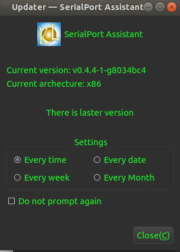

## Qt common library

================================================

Author：Kang Lin（kl222@126.com)

- [](https://ci.appveyor.com/project/KangLin/rabbitcommon/branch/master)
- [](https://travis-ci.org/KangLin/RabbitCommon)

[Chinese](README_zh_CN.md)

### Functions

Qt common library. include follow functions:

- [x] [About](#About)
- [x] [Updater](#Updater)
- [x] Tools
  - [x] [Execute the program with administrator privileges](#execute-the-program-with-administrator-privileges)
  - [x] [The program starts automatically](#the-program-starts-automatically)
  - [x] [Directory functions](#directory-functions)
- [x] Cross-platform, support multiple operating systems
  - [x] Windows
  - [x] Linux、Unix
  - [x] Android
  - [ ] Mac os
  - [ ] IOS
  
  Mac os and IOS, I don't have the corresponding equipment,
  please compile and test the students with the corresponding equipment.

### Compile
- Create and entry build directory

        git clone --recursive https://github.com/KangLin/RabbitCommon.git
        cd RabbitCommon
        mkdir build

- Compile
  + Use qmake 

        cd build
        qmake ../RabbitCommon.pro
        make install

      * Parameter
        - BUILD_ABOUT=OFF: Off build about
        - BUILD_UPDATE=OFF: Off build updater
        - BUILD_ADMINAUTHORISER＝OFF: Off admin authoriser
 
  + Use cmake
  
        cd build
        cmake .. -DQt5_DIR=${QT_ROOT}/lib/cmake/Qt5
        cmake --build .

      * Parameter
        - Qt5_DIR: Qt install position
        - BUILD_APP: build app
        - BUILD_ABOUT: build about
        - BUILD_UPDATE: build updater
        - BUILD_ADMINAUTHORISER: build admin authoriser
        
- Compilation notes:
    Use Qtcreate compile for android in windows, It may appear that the dependent library could not be found.

       Don't find D:\Source\build-RabbitCommon-Android_for_armeabi_v7a_Clang_Qt_5_12_4_for_Android_ARMv7-Debug\bin\libRabbitCommon.so
       move libRabbitCommon.so ..\bin\libRabbitCommon.so
       process_begin: CreateProcess(NULL, move libRabbitCommon.so ..\bin\libRabbitCommon.so, ...) failed.
       make (e=2): The system can not find the file specified。
       make[1]: [..\bin\libRabbitCommon.so] Error 2 (ignored)

    The reason is that the make program under windows cannot convert the \ in the path.
    Solution: Use a make program that recognizes the \ in the path, for example: mingw32-make.exe.

- Install notes:  
    + windows   
       If you build app. Qt does not provide openssl dynamic library for copyright reasons, so you must copy the dynamic library of openssl to the installation directory.
        - If it is 32, you can find the dynamic library of openssl (libeay32.dll, ssleay32.dll) in the Qt installer Tools\QtCreator\bin directory.
        - If it is 64-bit, you will need to download the binary installation package for openssl yourself.

    + linux

     ```
     sudo apt-get install libssl1.1
     ```

### Other application use the project
- Direct source code
  + QT pro file
    - submodule：
      + Add submodule：
      
            git submodule add https://github.com/KangLin/RabbitCommon.git 3th_libs/RabbitCommon
      
      + Introduce RabbitCommon.pri directly in the project file (.pro)

            include(3th_libs/RabbitCommon/RabbitCommon.pri)

    - No submodule：Specify the location of the RabbitCommon source root 
      in the environment variable (RabbitCommon_DIR)
      or QMAKE parameter (RabbitCommon_DIR),
      then add the following to the main project file (.pro):
    
            isEmpty(RabbitCommon_DIR): RabbitCommon_DIR=$$(RabbitCommon_DIR)
            !isEmpty(RabbitCommon_DIR): exists("$${RabbitCommon_DIR}/Src/RabbitCommon.pri"){
                DEFINES += RABBITCOMMON
                include($${RabbitCommon_DIR}/Src/RabbitCommon.pri)
            } else{
                message("1. Please download RabbitCommon source code from https://github.com/KangLin/RabbitCommon ag:")
                message("   git clone https://github.com/KangLin/RabbitCommon.git")
                error("2. Then set value RabbitCommon_DIR to download root dirctory")
            }
    
     - Add about files:

            isEmpty(PREFIX) {
                qnx : PREFIX = /tmp
                else : ios: PREFIX=/
                else : android : PREFIX = /
                else : unix : PREFIX = /opt/RabbitCommon
                else : PREFIX = $$OUT_PWD/install
            }

            DISTFILES += Authors.md \
                Authors_zh_CN.md \
                ChangeLog.md \
                License.md

            other.files = $$DISTFILES
            android: other.path = $$PREFIX/assets
            else: other.path = $$PREFIX
            other.CONFIG += directory no_check_exist 
            INSTALLS += other

    Because this way translation resources will be repeated in the target project.
    Therefore, The main pro file is TEMPLATE = subdirs, generally add the RabbitCommon directory under
    the target project source root directory,
    and then link to the project in this directory.
    Can see ：https://github.com/KangLin/Tasks
    
    - Static library

            CONFIG(static): DEFINES *= RABBITCOMMON_STATIC_DEFINE

  + cmake
    - Submodule
    
            add_subdirectory(3th_libs/RabbitCommon/Src)
        
    - No submodule
      + Introduced to add_subdirectory this directory

            if(NOT RabbitCommon_DIR)
                set(RabbitCommon_DIR $ENV{RabbitCommon_DIR})
                if(NOT RabbitCommon_DIR)
                    set(RabbitCommon_DIR ${CMAKE_SOURCE_DIR}/../RabbitCommon)
                endif()
            endif()
            if(DEFINED RabbitCommon_DIR AND EXISTS ${RabbitCommon_DIR}/Src)
                add_subdirectory(${RabbitCommon_DIR}/Src ${CMAKE_BINARY_DIR}/RabbitCommon)
            else()
                message("1. Please download RabbitCommon source code from https://github.com/KangLin/RabbitCommon")
                message("   ag:")
                message("       git clone https://github.com/KangLin/RabbitCommon.git")
                message("2. Then set cmake value or environment variable RabbitCommon_DIR to download root dirctory.")
                message("   ag:")
                message(FATAL_ERROR "       cmake -DRabbitCommon_DIR= ")
            endif()

      + CMakeLists.txt in the project used
      
            SET(APP_LIBS ${PROJECT_NAME} ${QT_LIBRARIES})
            if(TARGET RabbitCommon)
                target_compile_definitions(${PROJECT_NAME}
                                PRIVATE -DRABBITCOMMON)
                target_include_directories(${PROJECT_NAME}
                                PRIVATE ${RabbitCommon_DIR}/Src
                                        ${CMAKE_BINARY_DIR})
                set(APP_LIBS ${APP_LIBS} RabbitCommon)
            endif()
            target_link_libraries(${PROJECT_NAME} ${APP_LIBS})

    - Static library

             target_compile_definitions(${PROJECT_NAME} PRIVATE RABBITCOMMON_STATIC_DEFINE)

- Use in library mode
  + Qt pro file
  + cmake
    Cmake parameter RabbitCommon_DIR specifies the installation root directory
    
        find_package(RabbitCommon)

- Load resource

        RabbitCommon::CTools::Instance()->Init();

### Functions
#### [About](Src/DlgAbout/DlgAbout.h)

  + Install Authors、 License、 ChangeLog files.  
      File name naming rules:  
      Authors.md、License.md、ChangeLog.md is the default file.  
      The local file naming rule is to add the local name after the default file name.  
      For example: Chinese file:  
      Authors_zh_CN.md、License_zh_CN.md、ChangeLog_zh_CN.md

    
            isEmpty(PREFIX) {
                qnx : PREFIX = /tmp
                else : ios: PREFIX=/
                else : android : PREFIX = /
                else : unix : PREFIX = /opt/RabbitCommon
                else : PREFIX = $$OUT_PWD/install
            }

            DISTFILES += Authors.md \
                Authors_zh_CN.md \
                ChangeLog.md \
                License.md

            other.files = $$DISTFILES
            android: other.path = $$PREFIX/assets
            else: other.path = $$PREFIX
            other.CONFIG += directory no_check_exist 
            INSTALLS += other
            
  + Used in code
    
            ```
            QApplication a(argc, argv);
            a.setApplicationVersion(BUILD_VERSION);
            a.setApplicationName("SerialPortAssistant");
            a.setApplicationDisplayName(QObject::tr("SerialPortAssistant"));
        
            #ifdef RABBITCOMMON
                CDlgAbout about(this);
                about.m_AppIcon = QImage(":/icon/SerialPortAssistant");
                about.m_szHomePage = "https://github.com/KangLin/SerialPortAssistant";
                #if defined (Q_OS_ANDROID)
                    about.showMaximized();
                    about.exec();
                #else
                    about.exec();
                #endif
            #endif
            ```
  + See: https://github.com/KangLin/SerialPortAssistant


#### [Updater](Src/FrmUpdater/FrmUpdater.h)

  ```
  #ifdef RABBITCOMMON
      CFrmUpdater *fu = new CFrmUpdater();
      fu->SetTitle(QImage(":/image/SerialPortAssistant"), qApp->applicationDisplayName());
      #if defined (Q_OS_ANDROID)
          fu->showMaximized();
      #else
          fu->show();
      #endif
  #endif
  ```
  
  + Use CFrmUpdater::GenerateUpdateXml() to generate update xml file, use --help look up parameter

          ./TasksApp --help
          Usage: ./TasksApp [options]
          
          Options:
            -h, --help                       Displays this help.
            -v, --version                    Displays version information.
            -f, --file <xml file name>       xml file name
            --pv <Package version>           Package version
            -t, --time <Time>                Time
            -i, --info <Information>         Information
            -s, --system <Operating system>  Operating system
            -p, --platform <Platform>        Platform
            -a, --arch <Architecture>        Architecture
            -c, --md5 <MD5 checksum>         MD5 checksum
            -u, --url <Download url>         Package download url
            --home <Project home url>        Project home url
            -m, --min <Min update version>   Min update version

  + Add Update/update.xml in project source root direcory, then add the url to CFrmUpdater::DownloadFile.

          <?xml version="1.0" encoding="UTF-8"?>
          <REDIRECT>
              <VERSION>v1.0.3</VERSION>
              <WINDOWS>
                  <URL>url</URL>
              </WINDOWS>
              <LINUX>
                  <URL>url</URL>
              </LINUX>
              <LINUX_APPIMAGE>
                  <URL>url</URL>
              </LINUX_APPIMAGE>
              <ANDROID>
                  <URL>url</URL>
              </ANDROID>   
          </REDIRECT>
  
  + See: https://github.com/KangLin/SerialPortAssistant
  


#### [Execute the program with administrator privileges](Src/AdminAuthoriser/adminauthoriser.h)
  + Internal implementation

            QString szCmd = "mkdir";
            QStringList paras;
            paras << "-p" << "/opt/RabbitCommonAdminAuthoriseTest";
            qDebug() << "RabbitCommon::AdminAuthoriser::Instance()->execute(szCmd, paras):"
                     << RabbitCommon::AdminAuthoriser::Instance()->execute(szCmd, paras);

  + Public interface:

            RabbitCommon::CTools::executeByRoot("regedit", QStringList());

#### [The program starts automatically](Src/RabbitCommonTools.h)

        static int InstallStartRun(const QString &szName = QString(),
                               const QString &szPath = QString(),
                               bool bAllUser = false);
        static int RemoveStartRun(const QString &szName = QString(),
                              bool bAllUser = false);
        static bool IsStartRun(const QString &szName = QString(),
                           bool bAllUser = false);

#### [Directory functions](Src/RabbitCommonDir.h)

### Other projects using this project
- [Tasks](https://github.com/KangLin/Tasks)
- [LunarCalendar](https://github.com/KangLin/LunarCalendar)
- [SerialPortAssistant](https://github.com/KangLin/SerialPortAssistant)
- [FaceRecognizer](https://github.com/KangLin/FaceRecognizer)
- [TransformCoordinate](https://github.com/KangLin/TransformCoordinate)

### Donation


### [License](License.md "License.md")
