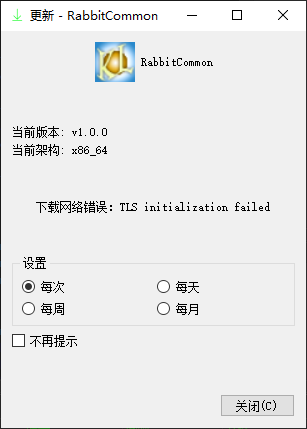

## Qt项目公共库

================================================

作者：康林（kl222@126.com)

[](https://github.com/KangLin/RabbitCommon/actions/workflows/build.yml)
[](https://github.com/KangLin/RabbitCommon/actions/workflows/build.yml)

[:us: 英语](README.md)

- 项目位置: https://github.com/KangLin/RabbitCommon
- 镜像位置：
  - https://sourceforge.net/projects/rabbitcommon/
  - https://gitlab.com/kl222/RabbitCommon
  - https://launchpad.net/rabbitcommon
  - https://invent.kde.org/kanglin/RabbitCommon
  - https://gitee.com/kl222/RabbitCommon
  - https://bitbucket.org/kl222/rabbitcommon

### 开发文档

[在线开发文档](https://kanglin.github.io/RabbitCommon/Chinese/html/index.html)

### 最后发行版本

[最后发行版本](https://github.com/KangLin/RabbitCommon/releases/latest)

### 功能

详见：[应用程序接口](https://kanglin.github.io/RabbitCommon/Chinese/html/group__API.html)

本人Qt项目的一些公共库，包括下列功能：

- [x] 图形界面
  - [x] [关于对话框](#关于对话框)
    + [cmark](https://github.com/commonmark/cmark): 用于解析 MarkDown 语法
  - [x] [在线更新](#在线更新)
  - [x] [样式(包括图标主题](Src/FrmStyle.h)
  - [x] [最近打开菜单](Src/RabbitRecentMenu.h)
  - [x] [自定义标题栏](Src/TitleBar.h)
  - [x] [文件夹浏览器](Src/FolderBrowser/FolderBrowser.h)
- [x] [从多个 URLs 下载同一文件](Src/DownloadFile.h)
- [x] [目录功能](Src/RabbitCommonDir.h)
- [x] [加解密](Src/RabbitCommonEncrypt.h)
- [x] [注册表](Src/RabbitCommonRegister.h)
- [x] [工具](Src/RabbitCommonTools.h)
  + [x] [用管理员权限执行程序](#管理员权限运行程序)
  + [x] [程序开机自启动](#程序开机自启动)
  + [x] 得到系统信息
    - [x] 得到当前登录用户
  + [x] 允许 core dump
- [x] cmake 函数
  + [x] 翻译资源
  + [x] 增加目标；插件目标
  + [x] 生成 pkg-config 配置文件
  + [x] 生成 cmake 配置文件
  + [x] 删除安装
- 跨平台，支持多操作系统
  + [x] Windows
  + [x] Linux、Unix
  + [x] Android
  + [ ] Mac os
  + [ ] IOS
  
  Mac os 和 IOS ，本人没有相应设备，请有相应设备的同学自己编译，测试。

  详见：[Qt5 支持平台](https://doc.qt.io/qt-5/supported-platforms.html)、[Qt6 支持平台](https://doc.qt.io/qt-6/supported-platforms.html)。
  
### 编译
- 建立并进入build目录

        git clone --recursive https://github.com/KangLin/RabbitCommon.git
        cd RabbitCommon
        mkdir build

- 编译
  + 用 cmake
  
        cd build
        cmake .. -DCMAKE_BUILD_TYPE=Release -DQt5_DIR=${QT_ROOT}/lib/cmake/Qt5
        cmake --build .

    * 参数
      - CMAKE_BUILD_TYPE: 编译类型
      - Qt5_DIR: Qt 位置
      - BUILD_DOCS: 编译 doxygen 文档
      - BUILD_APP: 编译应用程序
      - BUILD_ABOUT: 编译关于功能
      - BUILD_UPDATE: 编译在线更新功能
      - BUILD_ADMINAUTHORISER: 用管理员权限运行程序
        
    **注意**：如果使用 MSVC ,则需要加上 -DCMAKE_BUILD_TYPE=Debug ，否则当编译 Debug 时会出现下面错误：

    RabbitCommonTools.obj : error LNK2019: 无法解析的外部符号 "int __cdecl qInitResources_translations_RabbitCommon(void)" (?qInitResources_translations_RabbitCommon@@YAHXZ)，该符号在函数 "void __cdecl g_RabbitCommon_InitResource(void)" (?g_RabbitCommon_InitResource@@YAXXZ) 中被引用
    RabbitCommonTools.obj : error LNK2019: 无法解析的外部符号 "int __cdecl qCleanupResources_translations_RabbitCommon(void)" (?qCleanupResources_translations_RabbitCommon@@YAHXZ)，该符号在函数 "void __cdecl g_RabbitCommon_CleanResource(void)" (?g_RabbitCommon_CleanResource@@YAXXZ) 中被引用

    - linux
    
          cd build
          cmake .. -DCMAKE_INSTALL_PREFIX=`pwd`/install \
                 -DCMAKE_BUILD_TYPE=Release \
                 -DQT_DIR=... \
                 -DQt5_DIR=${QT_ROOT}/lib/cmake/Qt5
          cmake --build . --config Release --target install
        
    - windows
    
          cd build
          cmake .. -DCMAKE_INSTALL_PREFIX=`pwd`/install ^
                   -DCMAKE_BUILD_TYPE=Release ^
                   -DQT_DIR=... ^
                   -DQt5_DIR=${QT_ROOT}/lib/cmake/Qt5
          cmake --build . --config Release --target install

    - android
      + Qt6 及以上版本

            cd build
            ${Qt6_DIR}/bin/qt-cmake .. -DCMAKE_BUILD_TYPE=Release
            cmake --build . --config Release
        
        或者：
        
            cmake .. -DCMAKE_BUILD_TYPE=Release \
                -DCMAKE_INSTALL_PREFIX=`pwd`/android-build \
                -DCMAKE_TOOLCHAIN_FILE=$Qt6_DIR/lib/cmake/Qt6/qt.toolchain.cmake
            cmake --build . --config Release

      + Qt5
        + 主机是linux
    
                cd build
                cmake .. -DCMAKE_BUILD_TYPE=Release \
                     -DCMAKE_INSTALL_PREFIX=`pwd`/android-build \
                     -DCMAKE_TOOLCHAIN_FILE=${ANDROID_NDK}/build/cmake/android.toolchain.cmake \
                     -DANDROID_ABI="armeabi-v7a with NEON" \
                     -DANDROID_PLATFORM=android-18 \
                     -DQT_DIR=... \
                     -DQt5_DIR=
                cmake --build . --config Release --target all
    
        + 主机是windows
    
                cd build
                cmake .. -G"Unix Makefiles" ^
                   -DCMAKE_BUILD_TYPE=Release ^
                   -DCMAKE_INSTALL_PREFIX=`pwd`/android-build ^
                   -DCMAKE_TOOLCHAIN_FILE=${ANDROID_NDK}/build/cmake/android.toolchain.cmake ^
                   -DCMAKE_MAKE_PROGRAM=${ANDROID_NDK}/prebuilt/windows-x86_64/bin/make.exe ^
                   -DANDROID_PLATFORM=android-18 ^
                   -DANDROID_ABI=arm64-v8a ^
                   -DANDROID_ARM_NEON=ON ^
                   -DQT_DIR=... \
                   -DQt5_DIR=
                cmake --build . --config Release --target all
    
        - 参数说明：https://developer.android.google.cn/ndk/guides/cmake
          + ANDROID_ABI: 可取下列值：
            目标 ABI。如果未指定目标 ABI，则 CMake 默认使用 armeabi-v7a。  
            有效的目标名称为：
            - armeabi：带软件浮点运算并基于 ARMv5TE 的 CPU。
            - armeabi-v7a：带硬件 FPU 指令 (VFPv3_D16) 并基于 ARMv7 的设备。
            - armeabi-v7a with NEON：与 armeabi-v7a 相同，但启用 NEON 浮点指令。这相当于设置 -DANDROID_ABI=armeabi-v7a 和 -DANDROID_ARM_NEON=ON。
            - arm64-v8a：ARMv8 AArch64 指令集。
            - x86：IA-32 指令集。
            - x86_64 - 用于 x86-64 架构的指令集。
          + ANDROID_NDK <path> 主机上安装的 NDK 根目录的绝对路径
          + ANDROID_PLATFORM: 如需平台名称和对应 Android 系统映像的完整列表，请参阅 [Android NDK 原生 API](https://developer.android.google.cn/ndk/guides/stable_apis.html)
          + ANDROID_ARM_MODE
          + ANDROID_ARM_NEON
          + ANDROID_STL:指定 CMake 应使用的 STL。 
            - c++_shared: 使用 libc++ 动态库
            - c++_static: 使用 libc++ 静态库
            - none: 没有 C++ 库支持
            - system: 用系统的 STL
        - 安装 apk 到设备
    
               adb install android-build-debug.apk 

  + 用 qmake (已废弃，新程序请用 CMake)

        cd build
        qmake ../RabbitCommon.pro
        make install

    * 参数
      - BUILD_DOCS: 编译 doxygen 文档
      - BUILD_ABOUT=OFF: 关闭编译关于功能
      - BUILD_UPDATE=OFF: 关闭编译在线更新功能
      - BUILD_ADMINAUTHORISER＝OFF: 关闭用管理员权限运行程序


- 编译注意事项：
    用 Qtcreate 在 windows 下编译 android 平台

  + cmake

     - 设置 Generator 为 "Unix Makefiles"
     - 设置 CMAKE_MAKE_PROGRAM 为 ${ANDROID_NDK}/prebuilt/windows-x86_64/bin/make.exe

  + qmake。可能出现无法找到依赖库。(已废弃，新程序请用 CMake)

   找不到 D:\Source\build-RabbitCommon-Android_for_armeabi_v7a_Clang_Qt_5_12_4_for_Android_ARMv7-Debug\bin\libRabbitCommon.so
   move libRabbitCommon.so ..\bin\libRabbitCommon.so
   process_begin: CreateProcess(NULL, move libRabbitCommon.so ..\bin\libRabbitCommon.so, ...) failed.
   make (e=2): 系统找不到指定的文件。
   make[1]: [..\bin\libRabbitCommon.so] Error 2 (ignored)

其原因是 windows 下的 make 程序不能转换路径中的 \ 。  
解决方法：用可以识别路径中的 \ 的 make 程序，例如: mingw32-make.exe。

- 安装注意  
Qt因为版权原因，没有提供openssl动态库，所以必须自己复制openssl的动态库到安装目录下。
    + windows
        - 如果是32的，可以在Qt安装程序Tools\QtCreator\bin目录下，找到openssl的动态库（libeay32.dll、ssleay32.dll）
        - 如果是64位，则需要自己下载openssl的二进制安装包。
    + linux

        ```
        sudo apt-get install libssl1.1
        ```

### 其它应用使用本项目
- 以库方式使用使用
  + Qt 工程文件。(已废弃，新程序请用 CMake)

    以 pkg-config 形式查找库。设置 PKG_CONFIG_PATH 为安装路径。

  + cmake

    cmake 参数 RabbitCommon_DIR 指定安装根目录

        find_package(RabbitCommon)

- 直接用源码

        if(NOT RabbitCommon_DIR)
            set(RabbitCommon_DIR $ENV{RabbitCommon_DIR})
            if(NOT RabbitCommon_DIR)
                set(RabbitCommon_DIR ${CMAKE_SOURCE_DIR}/../RabbitCommon)
            endif()
        endif()
        if(RabbitCommon_DIR AND EXISTS ${RabbitCommon_DIR}/Src)
            message("Use RabbitCommon source code")
            add_subdirectory(${RabbitCommon_DIR}/Src ${CMAKE_BINARY_DIR}/RabbitCommon)
        else()
            find_package(RabbitCommon)
            if(NOT RabbitCommon_FOUND)
                message("RabbitCommon_DIR is not set. Please use one of the following ways to set it:")
                message("1. Set RabbitCommon_DIR to the install prefix of RabbitCommon.")
                message("2. Set RabbitCommon_DIR to source code root of RabbitCommon.")
                message("2.1 Please download the source code of RabbitCommon from https://github.com/KangLin/RabbitCommon")
                message("   ag:")
                message("       git clone https://github.com/KangLin/RabbitCommon.git")
                message("2.2 Then set cmake variable or environment variable RabbitCommon_DIR to download root directory.")
                message("   ag:")
                message("       cmake -DRabbitCommon_DIR= ")
                message(FATAL_ERROR "RabbitCommon_DIR isn't set.")
            endif()
        endif()

  + cmake工程
    - 子模块方式

          add_subdirectory(3th_libs/RabbitCommon/Src)

    - 非子模块方式
      + 下载 RabbitCommon 到与应用相同的目录

            git clone https://github.com/KangLin/RabbitCommon.git

      + 引入以 add_subdirectory 本项目录

            if(NOT RabbitCommon_DIR)
                set(RabbitCommon_DIR $ENV{RabbitCommon_DIR})
                if(NOT RabbitCommon_DIR)
                    set(RabbitCommon_DIR ${CMAKE_SOURCE_DIR}/../RabbitCommon)
                endif()
            endif()
            if(DEFINED RabbitCommon_DIR AND EXISTS ${RabbitCommon_DIR}/Src)
                add_subdirectory(${RabbitCommon_DIR}/Src ${CMAKE_BINARY_DIR}/RabbitCommon)
            else()
                message("RabbitCommon_DIR is not found. Please use one of the following ways to set it:")
                message("1. Set RabbitCommon_DIR to the install prefix of RabbitCommon.")
                message("2. Set RabbitCommon_DIR to source code root of RabbitCommon.")
                message("2.1 Please download the source code of RabbitCommon from https://github.com/KangLin/RabbitCommon")
                message("   ag:")
                message("       git clone https://github.com/KangLin/RabbitCommon.git")
                message("2.2 Then set cmake variable or environment variable RabbitCommon_DIR to download root directory.")
                message("   ag:")
                message("       cmake -DRabbitCommon_DIR= ")
                message(FATAL_ERROR "RabbitCommon_DIR isn't set.")
            endif()

      + 在使用的工程目录CMakeLists.txt
      
            target_link_libraries(${PROJECT_NAME} RabbitCommon)

    - 静态库

             target_compile_definitions(${PROJECT_NAME} PRIVATE RABBITCOMMON_STATIC_DEFINE)

- 在程序main开始处，初始化

        int main(int argc, char* argv[])
        {
            QApplication a(argc, argv);
            a.setApplicationName(......);
            RabbitCommon::CTools::Instance()->Init();
            
            ......
        }

### 功能

[在线开发文档](https://kanglin.github.io/RabbitCommon/Chinese/html/group__API.html)

#### 关于对话框

[DlgAbout.h](Src/DlgAbout/DlgAbout.h)

- 安装 Authors、 License、 ChangeLog 等文件。文件名命名规则：

  Authors.md、License.md、ChangeLog.md是默认文件。
  本地文件命名规则是在默认文件名后加上本地名。
  例如：中文件：  
  Authors_zh_CN.md、License_zh_CN.md、ChangeLog_zh_CN.md

        SET(OTHER_FILES
            ${CMAKE_SOURCE_DIR}/License.md
            ${CMAKE_SOURCE_DIR}/Authors.md
            ${CMAKE_SOURCE_DIR}/Authors_zh_CN.md
            ${CMAKE_SOURCE_DIR}/ChangeLog.md
            )
        INSTALL_FILE(SOURCES ${OTHER_FILES} DESTINATION "." COMPONENT Runtime)
            
- 代码中使用
    
        QApplication a(argc, argv);
        a.setApplicationVersion(RabbitCommon_VERSION);
        a.setApplicationName("Calendar");
        a.setApplicationDisplayName(QObject::tr("Calendar"));
      
        #ifdef RABBITCOMMON
            CDlgAbout about(this);
            about.m_AppIcon = QImage(":/image/Calendar");
            about.m_szHomePage = "https://github.com/KangLin/LunarCalendar";
            #if defined (Q_OS_ANDROID)
                about.showMaximized();
            #endif
            about.exec();
        #endif
            
- 参见例子： https://github.com/KangLin/LunarCalendar
    


#### 在线更新

[FrmUpdater.h](Src/FrmUpdater/FrmUpdater.h)

  ```
  #ifdef RABBITCOMMON
      CFrmUpdater *fu = new CFrmUpdater();
      fu->SetTitle(QImage(":/image/Calendar"), qApp->applicationDisplayName());
      #if defined (Q_OS_ANDROID)
          fu->showMaximized();
      #else
          fu->show();
      #endif
  #endif
  ```
  
- 可以用 CFrmUpdater::GenerateUpdateXml() 产生更新 xml 文件，可用命令行参数 --help 查看支持的命令参数
  
      ./TasksApp --help
      Usage: ./TasksApp [options]
            
      Options:
          -h, --help                       Displays this help.
          -v, --version                    Displays version information.
          -f, --file <xml file name>       xml file name
          --pv <Package version>           Package version
          -t, --time <Time>                Time
          -i, --info <Information>         Information
          -s, --system <Operating system>  Operating system
          -p, --platform <Platform>        Platform
          -a, --arch <Architecture>        Architecture
          -c, --md5 <MD5 checksum>         MD5 checksum
          -u, --url <Download url>         Package download url
          --home <Project home url>        Project home url
          -m, --min <Min update version>   Min update version

- 在目标工程源码目录中增加 Update/update.xml 文件，然后在程序中指定此 xml 文件做为 CFrmUpdater::DownloadFile 的 URL 参数

      <?xml version="1.0" encoding="UTF-8"?>
      <REDIRECT>
           <VERSION>v2.2.4</VERSION>
           <WINDOWS>
                <URL>url</URL>
           </WINDOWS>
           <LINUX>
                <URL>url</URL>
           </LINUX>
           <LINUX_APPIMAGE>
                <URL>url</URL>
           </LINUX_APPIMAGE>
           <ANDROID>
                <URL>url</URL>
           </ANDROID>   
      </REDIRECT>
  
- 参见例子： https://github.com/KangLin/LunarCalendar
   


#### 管理员权限运行程序

[adminauthoriser.h](Src/AdminAuthoriser/adminauthoriser.h)

+ 内部实现

      QString szCmd = "mkdir";
      QStringList paras;
      paras << "-p" << "/opt/RabbitCommonAdminAuthoriseTest";
      qDebug() << "RabbitCommon::AdminAuthoriser::Instance()->execute(szCmd, paras):"
          << RabbitCommon::AdminAuthoriser::Instance()->execute(szCmd, paras);

+ 公开接口：

      RabbitCommon::CTools::executeByRoot("regedit", QStringList());

#### 程序开机自启动

[程序开机自启动](Src/RabbitCommonTools.h)

        static int InstallStartRun(const QString &szName = QString(),
                               const QString &szPath = QString(),
                               bool bAllUser = false);
        static int RemoveStartRun(const QString &szName = QString(),
                              bool bAllUser = false);
        static bool IsStartRun(const QString &szName = QString(),
                           bool bAllUser = false);

#### 得到系统信息
- 得到当前登录用户

        RabbitCommon::CTools::GetCurrentUser();
        
- 得到主机名

        RabbitCommon::CTools::GetHostName();
        
### 使用本项目的项目
- [玉兔即时通讯](https://github.com/KangLin/RabbitIm)
- [玉兔远程控制](https://github.com/KangLin/RabbitRemoteControl)
- [日历](https://github.com/KangLin/Calendar)
- [农历日历](https://github.com/KangLin/LunarCalendar)
- [串口助手](https://github.com/KangLin/SerialPortAssistant)
- [人脸识别](https://github.com/KangLin/FaceRecognizer)
- [坐标转换](https://github.com/KangLin/TransformCoordinate)
- [中国象棋](https://github.com/KangLin/ChineseChessControl)

### 捐赠


### 许可协议

[许可协议](License.md "License.md")
