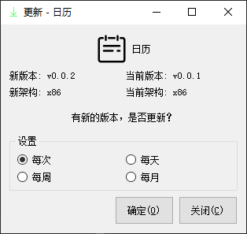

## Qt项目公共库

================================================

作者：康林（kl222@126.com)

- [](https://ci.appveyor.com/project/KangLin/rabbitcommon/branch/master)
- [](https://travis-ci.org/KangLin/RabbitCommon)

[英语](README.md)

### 功能

本人Qt项目的一些公共库，包括下列功能：

- [x] [关于对话框](#关于对话框)
- [x] [在线更新](#在线更新)
- [x] 工具
  + [x] [用管理员权限执行程序](#管理员权限运行程序)
  + [x] [程序开机自启动](#程序开机自启动)
  + [x] [目录功能](#目录功能)
- 跨平台，支持多操作系统
  + [x] Windows
  + [x] Linux、Unix
  + [x] Android
  + [ ] Mac os
  + [ ] IOS
  
  Mac os 和 IOS ，本人没有相应设备，请有相应设备的同学自己编译，测试。
  
### 编译
- 建立并进入build目录

        git clone --recursive https://github.com/KangLin/RabbitCommon.git
        cd RabbitCommon
        mkdir build

- 编译
  + 用 qmake 

        cd build
        qmake ../RabbitCommon.pro
        make install

      * 参数
        - BUILD_ABOUT=OFF: 关闭编译关于功能
        - BUILD_UPDATE=OFF: 关闭编译在线更新功能
        - BUILD_ADMINAUTHORISER＝OFF: 关闭用管理员权限运行程序
        
  + 用 cmake
  
        cd build
        cmake .. -DQt5_DIR=${QT_ROOT}/lib/cmake/Qt5
        cmake --build .

      * 参数
        - Qt5_DIR: Qt 位置
        - BUILD_APP: 编译应用程序
        - BUILD_ABOUT: 编译关于功能
        - BUILD_UPDATE: 编译在线更新功能
        - BUILD_ADMINAUTHORISER: 用管理员权限运行程序
        
- 编译注意事项：
    用Qtcreate在windows下编译android平台时，可能出现无法找到依赖库。

       找不到 D:\Source\build-RabbitCommon-Android_for_armeabi_v7a_Clang_Qt_5_12_4_for_Android_ARMv7-Debug\bin\libRabbitCommon.so
       move libRabbitCommon.so ..\bin\libRabbitCommon.so
       process_begin: CreateProcess(NULL, move libRabbitCommon.so ..\bin\libRabbitCommon.so, ...) failed.
       make (e=2): 系统找不到指定的文件。
       make[1]: [..\bin\libRabbitCommon.so] Error 2 (ignored)

    其原因是windows下的make程序不能转换路径中的 \ 。  
    解决方法：用可以识别路径中的 \ 的 make 程序，例如: mingw32-make.exe。

- 安装注意  
Qt因为版权原因，没有提供openssl动态库，所以必须自己复制openssl的动态库到安装目录下。
    + windows
        - 如果是32的，可以在Qt安装程序Tools\QtCreator\bin目录下，找到openssl的动态库（libeay32.dll、ssleay32.dll）
        - 如果是64位，则需要自己下载openssl的二进制安装包。
    + linux

        ```
        sudo apt-get install libssl1.1
        ```

### 其它应用使用本项目
- 直接用源码
  + QT工程文件
    - 子模块方式：
      + 增加子模块：
      
            git submodule add https://github.com/KangLin/RabbitCommon.git 3th_libs/RabbitCommon
      
      + 在工程文件(.pro)中直接引入 RabbitCommon.pri

            include(3th_libs/RabbitCommon/RabbitCommon.pri)

    - 非子模块方式：在环境变量（RabbitCommon_DIR） 或 QMAKE参数 （RabbitCommon_DIR） 
      中指定 RabbitCommon 源码根目录的位置，然后在主工程文件（.pro）中加入下列：
    
            isEmpty(RabbitCommon_DIR): RabbitCommon_DIR=$$(RabbitCommon_DIR)
            !isEmpty(RabbitCommon_DIR): exists("$${RabbitCommon_DIR}/Src/RabbitCommon.pri"){
                DEFINES += RABBITCOMMON
                include($${RabbitCommon_DIR}/Src/RabbitCommon.pri)
            } else{
                message("1. Please download RabbitCommon source code from https://github.com/KangLin/RabbitCommon ag:")
                message("   git clone https://github.com/KangLin/RabbitCommon.git")
                error("2. Then set value RabbitCommon_DIR to download root dirctory")
            }
    
     - 增加帮助文件：

            isEmpty(PREFIX) {
                qnx : PREFIX = /tmp
                else : ios: PREFIX=/
                else : android : PREFIX = /
                else : unix : PREFIX = /opt/RabbitCommon
                else : PREFIX = $$OUT_PWD/install
            }

            DISTFILES += Authors.md \
                Authors_zh_CN.md \
                ChangeLog.md \
                License.md

            other.files = $$DISTFILES
            android: other.path = $$PREFIX/assets
            else: other.path = $$PREFIX
            other.CONFIG += directory no_check_exist 
            INSTALLS += other

     因为此种方式翻译资源会在目标项目中重复。所以，主程序工程以 TEMPLATE = subdirs ， 在目标项目源码根目录下增加 RabbitCommon 子目录，在此目录下再链接到本项目。可以参见：https://github.com/KangLin/Tasks
    - 静态库

            CONFIG(static): DEFINES *= RABBITCOMMON_STATIC_DEFINE

  + cmake工程
    - 子模块方式
    
            add_subdirectory(3th_libs/RabbitCommon/Src)
        
    - 非子模块方式
      + 引入以 add_subdirectory 本项目录

            if(NOT RabbitCommon_DIR)
                set(RabbitCommon_DIR $ENV{RabbitCommon_DIR})
                if(NOT RabbitCommon_DIR)
                    set(RabbitCommon_DIR ${CMAKE_SOURCE_DIR}/../RabbitCommon)
                endif()
            endif()
            if(DEFINED RabbitCommon_DIR AND EXISTS ${RabbitCommon_DIR}/Src)
                add_subdirectory(${RabbitCommon_DIR}/Src ${CMAKE_BINARY_DIR}/RabbitCommon)
            else()
                message("1. Please download RabbitCommon source code from https://github.com/KangLin/RabbitCommon")
                message("   ag:")
                message("       git clone https://github.com/KangLin/RabbitCommon.git")
                message("2. Then set cmake value or environment variable RabbitCommon_DIR to download root dirctory.")
                message("   ag:")
                message(FATAL_ERROR "       cmake -DRabbitCommon_DIR= ")
            endif()

      + 在使用的工程目录CMakeLists.txt
      
            SET(APP_LIBS ${PROJECT_NAME} ${QT_LIBRARIES})
            if(TARGET RabbitCommon)
                target_compile_definitions(${PROJECT_NAME}
                                PRIVATE -DRABBITCOMMON)
                target_include_directories(${PROJECT_NAME}
                                PRIVATE ${RabbitCommon_DIR}/Src
                                        ${CMAKE_BINARY_DIR})
                set(APP_LIBS ${APP_LIBS} RabbitCommon)
            endif()
            target_link_libraries(${PROJECT_NAME} ${APP_LIBS})

    - 静态库

             target_compile_definitions(${PROJECT_NAME} PRIVATE RABBITCOMMON_STATIC_DEFINE)

- 以库方式使用使用
  + Qt 工程文件
  + cmake
    cmake 参数 RabbitCommon_DIR 指定安装根目录
    
        find_package(RabbitCommon)

- 加载资源

        RabbitCommon::CTools::Instance()->Init();

### 具体功能
#### [关于对话框](Src/DlgAbout/DlgAbout.h)

  + 安装 Authors、 License、 ChangeLog 等文件。文件名命名规则： 
      Authors.md、License.md、ChangeLog.md是默认文件。本地文件命名规则是在默认文件名后加上本地名。例如：中文件： 
      Authors_zh_CN.md、License_zh_CN.md、ChangeLog_zh_CN.md

    
            isEmpty(PREFIX) {
                qnx : PREFIX = /tmp
                else : ios: PREFIX=/
                else : android : PREFIX = /
                else : unix : PREFIX = /opt/RabbitCommon
                else : PREFIX = $$OUT_PWD/install
            }

            DISTFILES += Authors.md \
                Authors_zh_CN.md \
                ChangeLog.md \
                License.md

            other.files = $$DISTFILES
            android: other.path = $$PREFIX/assets
            else: other.path = $$PREFIX
            other.CONFIG += directory no_check_exist 
            INSTALLS += other
            
  + 代码中使用
    
            ```
            QApplication a(argc, argv);
            a.setApplicationVersion(BUILD_VERSION);
            a.setApplicationName("Calendar");
            a.setApplicationDisplayName(QObject::tr("Calendar"));
        
            #ifdef RABBITCOMMON
                CDlgAbout about(this);
                about.m_AppIcon = QPixmap(":/image/Calendar");
                about.m_szHomePage = "https://github.com/KangLin/LunarCalendar";
                #if defined (Q_OS_ANDROID)
                    about.showMaximized();
                #endif
                about.exec();
            #endif
            ```
  + 参见例子： https://github.com/KangLin/LunarCalendar
    


#### [在线更新](Src/FrmUpdater/FrmUpdater.h)

  ```
  #ifdef RABBITCOMMON
      CFrmUpdater *fu = new CFrmUpdater();
      fu->SetTitle(qApp->applicationDisplayName(), QPixmap(":/image/Calendar"));
      #if defined (Q_OS_ANDROID)
          fu->showMaximized();
      #else
          fu->show();
      #endif
  #endif
  ```
  
  + 可以用 CFrmUpdater::GenerateUpdateXml() 产生更新 xml 文件，可用命令行参数 --help 查看支持的命令参数
  
            ./TasksApp --help
            Usage: ./TasksApp [options]
            
            Options:
              -h, --help                       Displays this help.
              -v, --version                    Displays version information.
              -f, --file <xml file name>       xml file name
              --pv <Package version>           Package version
              -t, --time <Time>                Time
              -i, --info <Information>         Information
              -s, --system <Operating system>  Operating system
              -p, --platform <Platform>        Platform
              -a, --arch <Architecture>        Architecture
              -c, --md5 <MD5 checksum>         MD5 checksum
              -u, --url <Download url>         Package download url
              --home <Project home url>        Project home url
              -m, --min <Min update version>   Min update version

  + 在目标工程源码目录中增加 Update/update.xml 文件，然后在程序中指定此 xml 文件做为 CFrmUpdater::DownloadFile 的 URL 参数

            <?xml version="1.0" encoding="UTF-8"?>
            <REDIRECT>
                <VERSION>v0.0.1</VERSION>
                <WINDOWS>
                    <URL>url</URL>
                </WINDOWS>
                <LINUX>
                    <URL>url</URL>
                </LINUX>
                <LINUX_APPIMAGE>
                    <URL>url</URL>
                </LINUX_APPIMAGE>
                <ANDROID>
                    <URL>url</URL>
                </ANDROID>   
            </REDIRECT>
  
  + 参见例子： https://github.com/KangLin/LunarCalendar
   


#### [管理员权限运行程序](Src/AdminAuthoriser/adminauthoriser.h)
  + 内部实现

            QString szCmd = "mkdir";
            QStringList paras;
            paras << "-p" << "/opt/RabbitCommonAdminAuthoriseTest";
            qDebug() << "RabbitCommon::AdminAuthoriser::Instance()->execute(szCmd, paras):"
                     << RabbitCommon::AdminAuthoriser::Instance()->execute(szCmd, paras);

  + 公开接口：

            RabbitCommon::CTools::executeByRoot("regedit", QStringList());

#### [程序开机自启动](Src/RabbitCommonTools.h)

        static int InstallStartRun(const QString &szName = QString(),
                               const QString &szPath = QString(),
                               bool bAllUser = false);
        static int RemoveStartRun(const QString &szName = QString(),
                              bool bAllUser = false);
        static bool IsStartRun(const QString &szName = QString(),
                           bool bAllUser = false);

#### [目录功能](Src/RabbitCommonDir.h)

### 使用本项目的项目
- [Tasks](https://github.com/KangLin/Tasks)
- [LunarCalendar](https://github.com/KangLin/LunarCalendar)
- [SerialPortAssistant](https://github.com/KangLin/SerialPortAssistant)

### 捐赠


### [许可协议](License.md "License.md")
